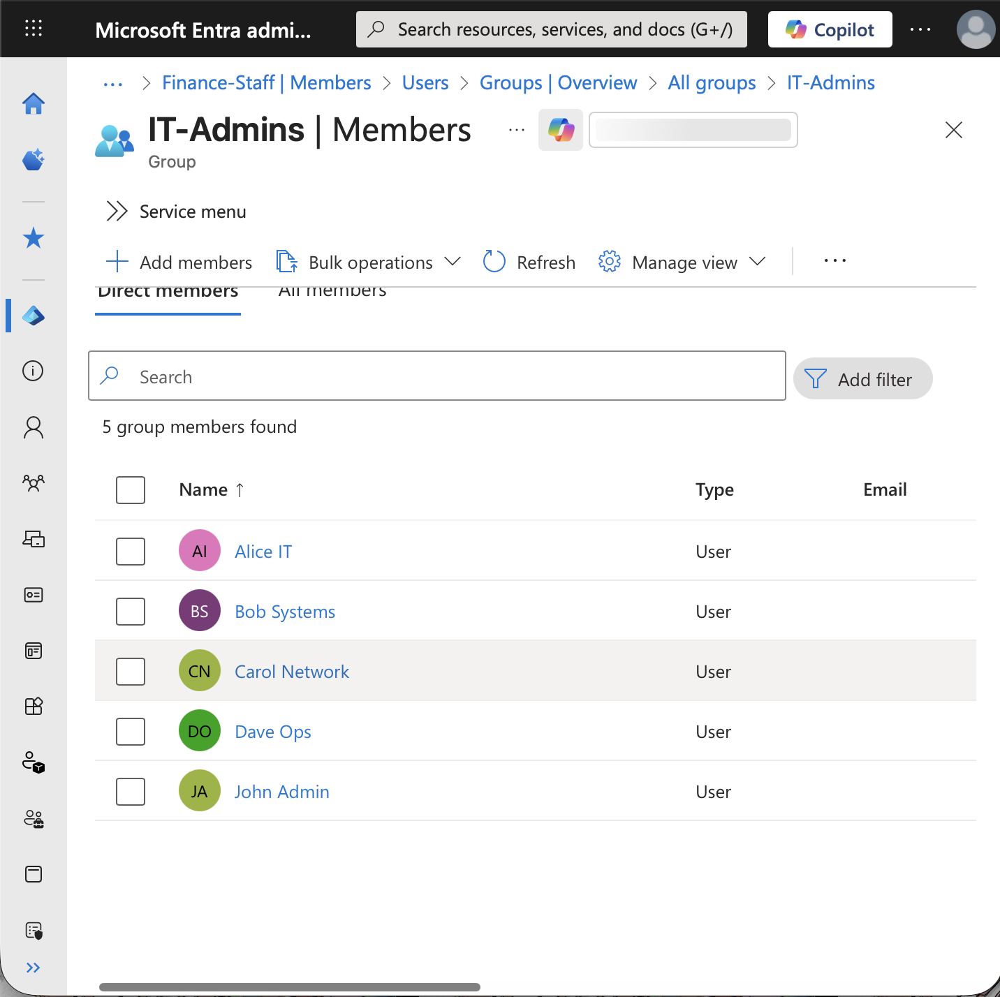
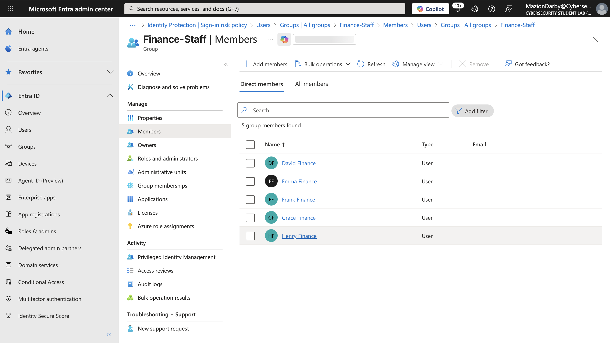
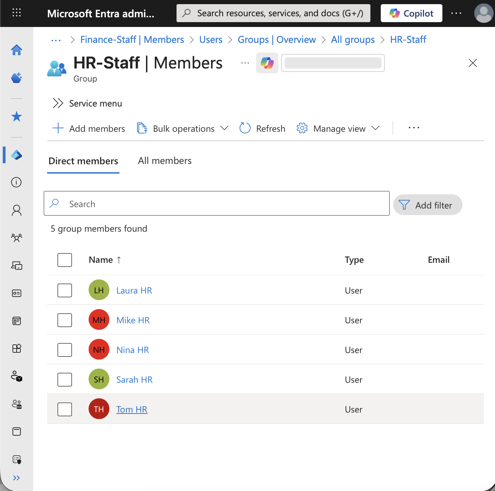
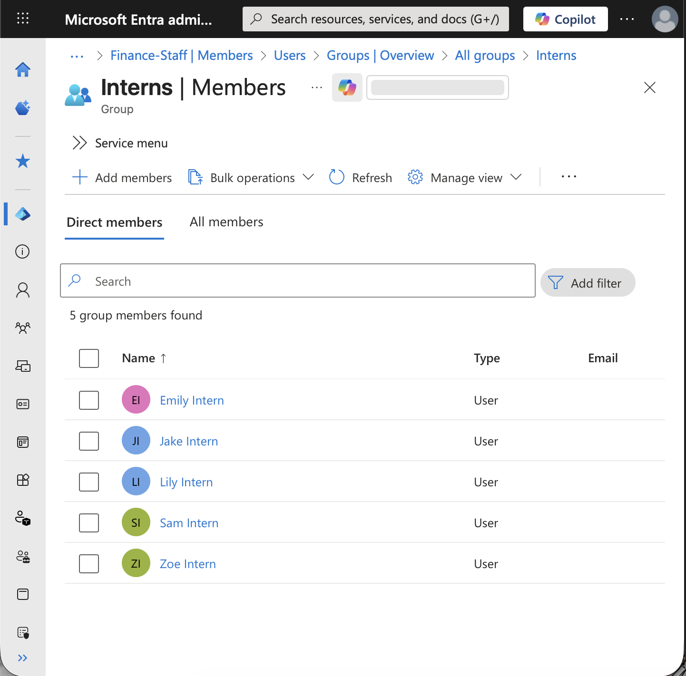
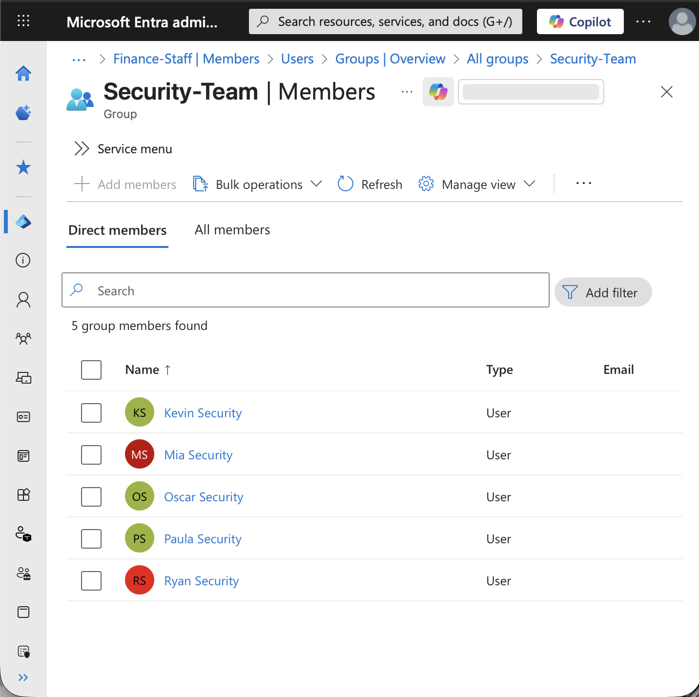
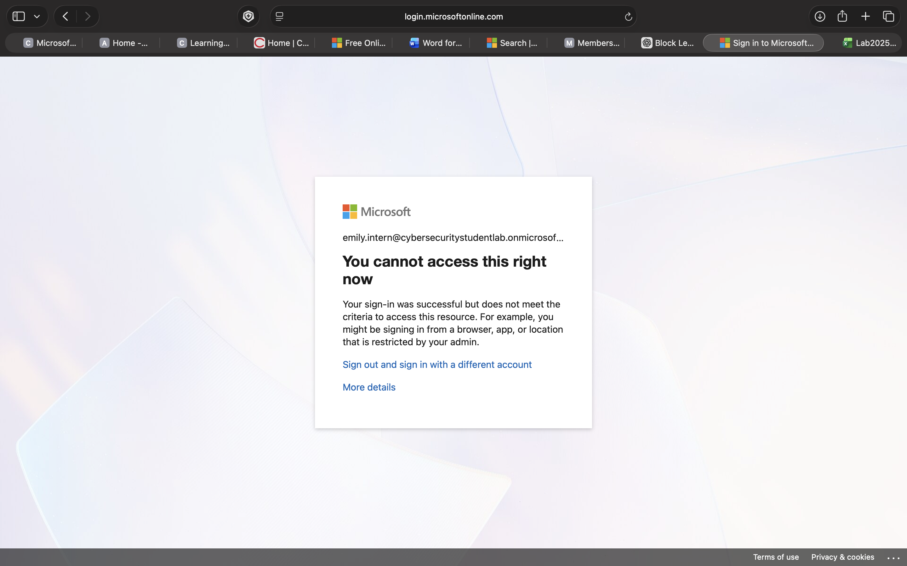
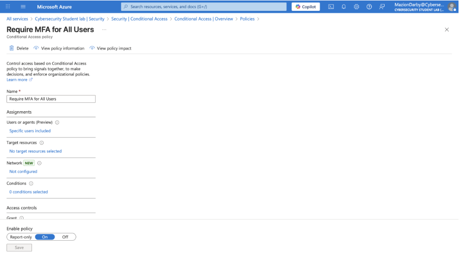

# Azure IAM Access Control Lab

## Overview
Built and configured a Microsoft Entra ID tenant to simulate an enterprise identity and access management (IAM) environment.

## Skills Demonstrated
- User Provisioning
- Access Management
- Microsoft Entra ID
- Multi-Factor Authentication (MFA)
- Conditional Access
- Group-Based Access Control
- Identity and Access Management (IAM)

## Project Objectives
- Create and manage user accounts
- Configure security groups
- Implement MFA policies
- Configure Conditional Access controls
- Test authentication workflows
- Apply role-based access principles

## Technologies Used
- Microsoft Entra ID
- Azure Portal
- CSV Bulk User Import
- MFA
- Conditional Access

## Results
Successfully provisioned and managed 25+ user accounts, implemented authentication controls, and documented access management workflows within a simulated enterprise environment.

## Screenshots
Screenshots demonstrating user provisioning, MFA configuration, Conditional Access policies, and access management activities are included in this repository.

### User Administration

### Finance Staff Group

### HR Staff Group

### Interns Group

### Security Team Group

### Multi-Factor Authentication (MFA)

### Conditional Access Policy

